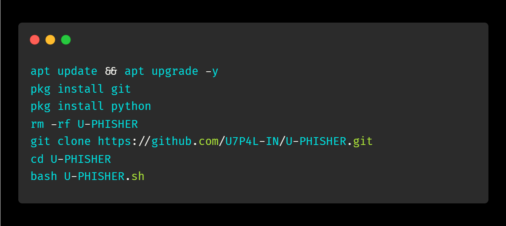
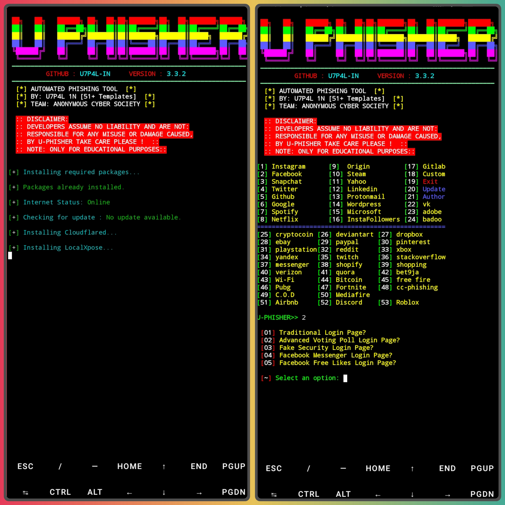
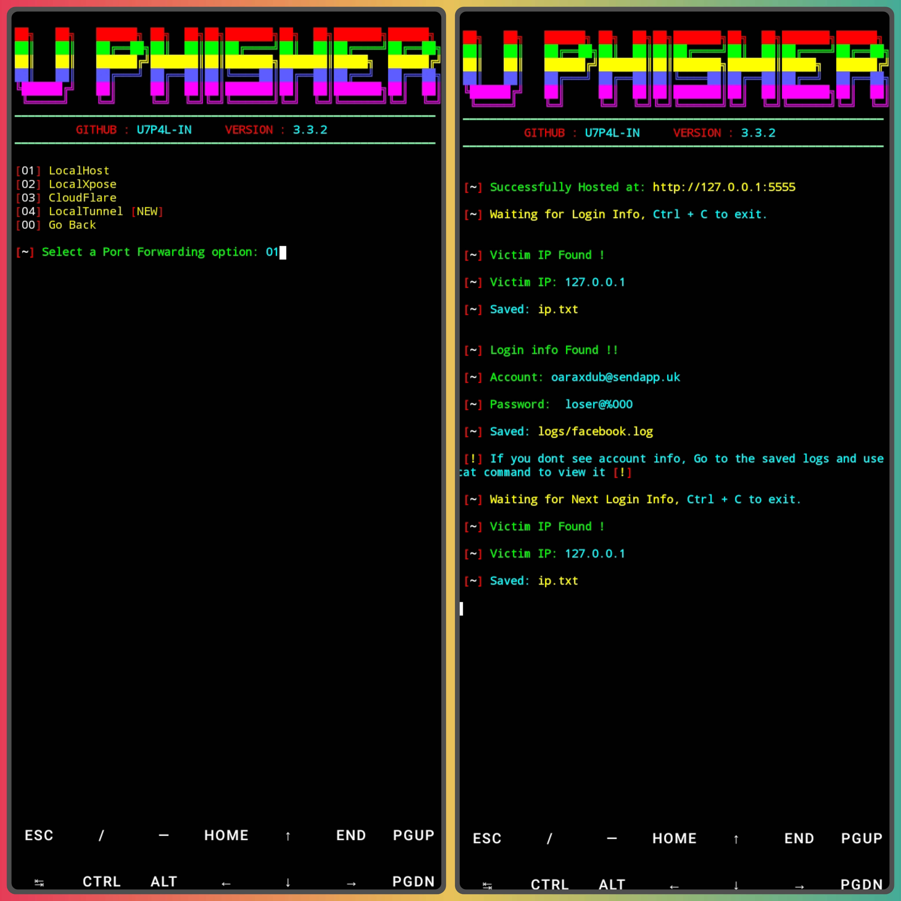
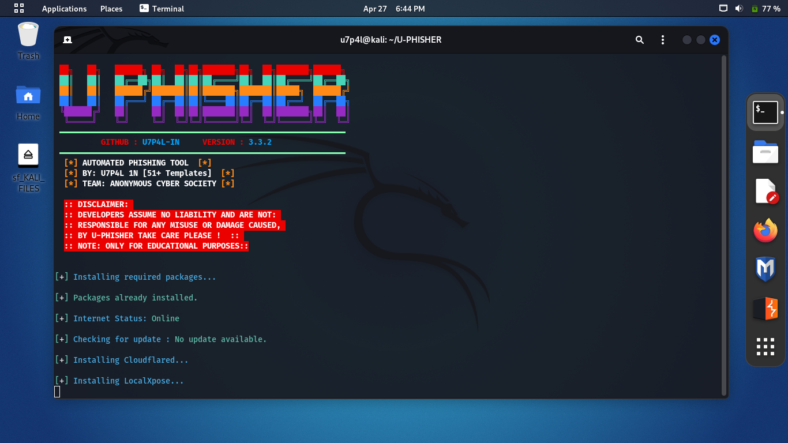
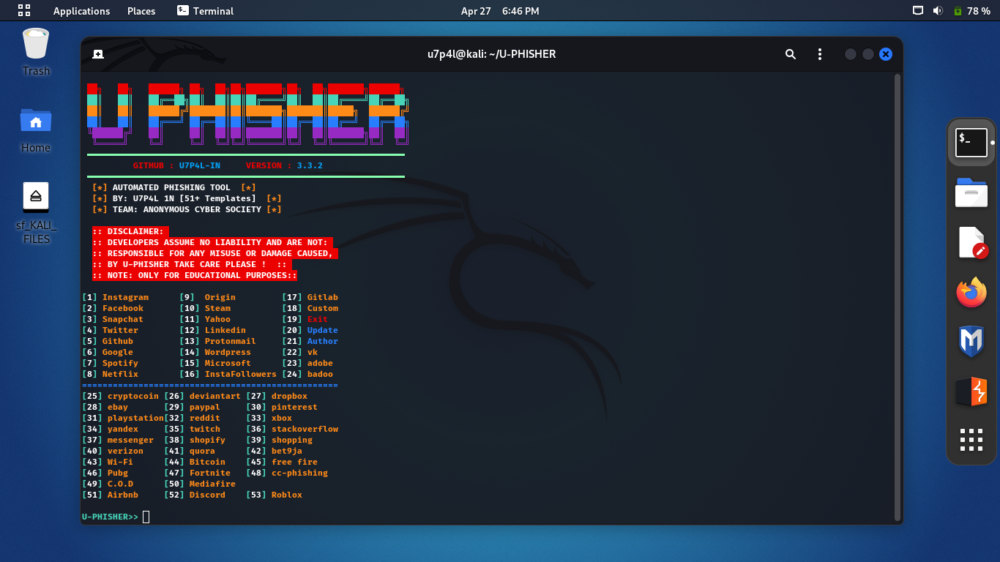
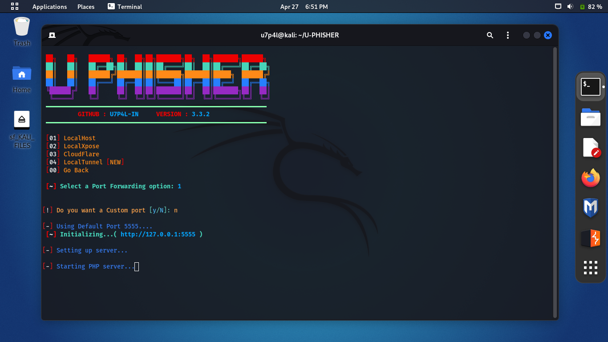
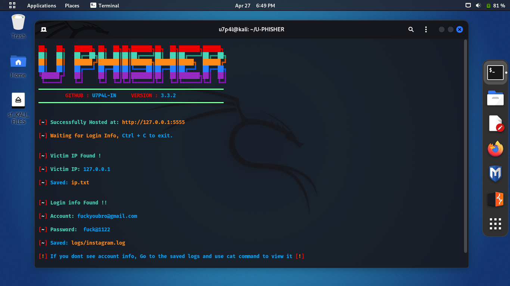

<p align="center">
</p>

</p>
   <p align="center">
      <a href="https://github.com/U7P4L-IN/U-PHISHER/stargazers">
      </a>
      <a href="https://github.com/U7P4L-IN/U-PHISHER/releases/latest">
      </a>
      <a href="https://www.conventionalcommits.org/en/v1.0.0/">
      </a>
      <a href="https://github.com/U7P4L-IN/U-PHISHER/actions/workflows/github-action.yml">
      </a>
   </p>

>Automated Phishing To Phish Various Sites With 51+ Templates And Also Has An Inbuilt Reverse Proxy Already To Easily Help You Generate Your Link And Send It To Your Victim. 
>This U-phisher Tool Is Made With Pure Bash Script And Needs Required Packages For It To Work.
</p>

## Tested on
This Tool Has Been Tested On The Following Systems:

- [✔] Termux
- [✔] Kali Linux
- [✔] Parrot OS

## Features

**Phishing Tool for Instagram, Facebook,  Airbnb, Twitter, Snapchat, Github, Yahoo, Protonmail, Google, Spotify, Netflix, Linkedin, Wordpress, Origin, Steam, Microsoft, InstaFollowers, fortnite, cod...+33**


## New Features 2024
-  [+] Airbnb Phishing page !
-  [+] CloudFlare Added !
-  [+] Latest Login Pages !
-  [+] LocalTunnel Added !
-  [+] 5 Port Forwarding Options !
-  [+] Discord and Roblox Phishing Pages Added !

## Version
```
Version 3.3.2
```

## Requirements
```
PHP
Unzip
Curl
Internet connection 
Linux system (RECOMMENDED)
```

<h4 align="left">INSTALL TOOL ON TERMUX > </h4>
 
```python
apt update && apt upgrade -y
pkg install git
pkg install python
rm -rf U-PHISHER
git clone https://github.com/U7P4L-IN/U-PHISHER.git
cd U-PHISHER
bash U-PHISHER.sh
```
<p align="center">

<h5 align="center"><b>TERMUX</b></h5>

<p align="center">
<p align="center";> 

<hr>

<h2 align="left">Install Requirements (on Linux) > </h2><br>

```python
>> apt-get install git python3 python3-pip python python-pip
```
<h2 align="left">Kali Linux/Ubuntu/Parrot os > </h2><br>

**Open up your terminal and clone the repo**
```python
sudo apt-get update && apt-get install git
git clone https://github.com/U7P4L-IN/U-PHISHER.git
cd U-PHISHER
bash U-PHISHER.sh
```
<h5 align="center"><b>KALI LINUX</b></h5>

<p align="center">
<p align="center">
<p align="center">
<p align="center">


## Installation via ".deb" file
* Download <code>.deb</code> file from the <a href="https://github.com/U7P4L-IN/U-PHISHER/releases/latest">Latest Release</a>
* If your using <b>Termux</b> download the one with <code>*_termux.deb</code>
* Install the <code>.deb</code> file by Typing:
```
apt install <your path to deb file>
```
OR
```
sudo dpkg -i <your path to deb file>
apt install -f
```
* Then type <code>U-PHISHER</code> If Your Using <b>Termux</b> or Type <code>sudo U-PHISHER</code> If Your Using A Debian Based System


## Tunelling Options :
> Localhost (127.0.0.1)
> LOCALXPOSE (https://localxpose.io/)
> CLOUDFLARE (https://cloudflare.com)
> LOCALTUNNEL (https://LocalTunnel.me)


## Update
> U-PHISHER tool will be updated monthly so as to make it much more better and also more templates will be added to the tool for you to use. 
To update the tool, run the <b>bash U-PHISHER.sh </b>and type number 20 from the list of options that appears..Then you can continue the rest yourself...haha

<h4>After You Have Run The Bash Install.Sh Dont Run It Next Time Your Using It, It Will Be Deleted Only Run The bash U-PHISHER.sh ✨✨
</h4>
<p align="center">
 
# Faqs
-  [1] What if i dont see the account info in termux? !
If You Do Not See The Account Info In The U-PHISHER Terminal, Simply Go Into The U-phisher Logs Directory And Use The Cat Command To Display The Log.

### Languages :

<p align="center">
</p>

# Report bugs
If you notice issues while installing this tool or running this tool kindly mail to me at <a href="mailto: lisame0007@gmail.com">Gmail</a> or Open an issue via github.

### Contributing
Feel Free To Clone This Project. For Major Changes, Please Open An Issue First To Discuss What You Would Like To Change Or Add, Thank You!!.

<h2 align="center">LICENSE</h2>

**U-PHISHER** Tools is released under the MIT license, which grants the following permissions:
- Commercial use
- Modification
- Distribution
- Patent use
- Private use

For more convoluted language, see the [LICENSE](/LICENSE).
</br>
<p align="center">  <a href="https://t.me/TheU7p4lArmyX"></a></p>
</br>

<h3 align="center"><b>DESCRIPTION</b></h3>

* ©️ Copyright Message
>> Copyright © [2023-27] [U7P4L-IN]
>All rights reserved. This Python project, along with its code, documentation, and any associated files, is the intellectual property of ANONYMOUS CYBER. You may not reproduce, distribute, or modify the contents of this repository without explicit permission from the owner.
## Give A Star ⭐
> You can also give this repository a star to show more people and they can use this repository.